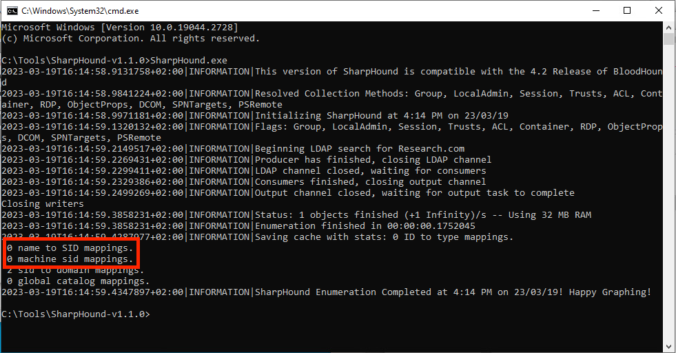

[](https://github.com/zeronetworks/ldapfw/releases/latest)


<p align="center"></p>

# Introduction
`LDAP Firewall` is an open-source tool for Windows servers that lets you audit and restrict incoming LDAP requests.<br>
Its primary use-cases are to protect Domain Controllers, block LDAP-based attacks and tightly control access to the Active Directory schema (e.g enforcing read-only access for users).<br>
The tool is written in C++ and makes use of the [Microsoft Detours](https://github.com/microsoft/Detours) and [JsonCpp](https://github.com/open-source-parsers/jsoncpp) packages.

Some useful resources to get you started:
- [Introduction blog post](https://zeronetworks.com/blog/ldap-firewall-level-up-your-dc-security/) - basics of LDAP and overview of the tool   
- [Technical Deep Dive blog post](https://zeronetworks.com/blog/a-technical-deep-dive-of-ldap-firewall/) - reverse-engineering the Windows LDAP service and how LDAP Firewall works 
- [Tutorial video](https://www.youtube.com/watch?v=CmV9SDbFW2c) - covers how to install and use the tool
- [LDAP Firewall Workshop video](https://www.youtube.com/watch?v=XsIzA8yal20) - from DEATHCon 2023

## Main Features
- Allow / block incoming LDAP queries based on different parameters (operation type, source IP, user, DN etc.)
- Event logging for LDAP queries

## How It Works
The LDAP Firewall inspects incoming [LDAP operations](https://ldap.com/ldap-operation-types/) (which are used to read or modify entries in the AD schema) and allows or blocks the request based on the configured rules.<br>
The operation also gets written into the Windows Event Log  with the LDAPFW action and other relevant fields (Distinguished Name, attributes, OID etc.).

## Who is this made for?
- <b>Security Engineers</b> who want to control LDAP access and achieve a Least Privilege model
- <b>Threat Hunters and SOC analysts</b> who want to be create detections and perform investigations around LDAP
- <b>Security Researchers</b> who want to explore and deepen their understanding of the protocol

## Preventing Attacks with LDAPFW
This section describes some common LDAP-based attacks that can be mitigated with the LDAP Firewall.<br>
Sample <i>config.json</i> files can be found in the [example_configs](./example_configs) folder of this repository.
### sAMAccountName spoofing
LDAPFW can be configured to block all [Add operations](https://ldap.com/the-ldap-add-operation/) in order to completely prevent [Name Impersonation](https://www.thehacker.recipes/ad/movement/kerberos/samaccountname-spoofing#cve-2021-42278-name-impersonation) ([CVE-2021-42278](https://msrc.microsoft.com/update-guide/vulnerability/CVE-2021-42278)) and thus defend against [sAMAccountName spoofing](https://www.thehacker.recipes/ad/movement/kerberos/samaccountname-spoofing).
<br>
<p align="center"></p>
<p align="center"><b><i>Audit of an LDAP Add operation being blocked <br>(produced using the <a href="https://github.com/Synzack/ldapper">Ldapper</a> addComputer command)</i></b></p>

### BloodHound
Stop [BloodHound](https://github.com/BloodHoundAD/BloodHound) scans by blocking searches on uncommon attributes (such as <i>admincount</i>, <i>userpassword</i> and <i>msds-allowedToDelegateTo</i>).
<p align="center"></p>
<p align="center"><b><i>SharpHound unable to obtain entities from LDAP</i></b></p>

### LAPS
Protect LAPS passwords by monitoring and blocking attempts to read the <i>ms-Mcs-AdmPwd</i> computer attribute. 

# Getting started
Get the latest binary from the [release page](https://github.com/zeronetworks/ldapfw/releases), or build from source.

## Prerequisites
Currently supported and tested on Windows Server 2016 and up.<br>
Internet access is required for fetching symbols from the [Microsoft public symbol server](https://learn.microsoft.com/en-us/windows-hardware/drivers/debugger/microsoft-public-symbols).<br>

If you get an error about missing DLLs (VCRUNTIME140.dll / MSVCP140.dll), install the [Microsoft Visual C++ 2015 - 2022 Redistributable](https://aka.ms/vs/17/release/vc_redist.x64.exe).
## Usage
```
ldapFwManager.exe /help

Usage: ldapFwManager /<Command> [options]

Command:
----------
/install - install and start LDAP Firewall protection
/uninstall - remove LDAP Firewall protection
/update - reload config.json and update the LDAPFW configuration (while installed)
/status - print status
/help - show this help message and exit

Debug Options: (use with /install or /status)
----------
/v - enable debug logging (stored in %AppData%\LDAPFW)
/vv - enable verbose debug logging. Warning - this will generate a large logfile and may
 affect performance.
```

### Status
Before installing LDAPFW for the first time, run with `/status` to make sure all prerequisites are met:
```
ldapFwManager.exe /status
LDAP Firewall v0.0.1

Status:
---------------------
LDAPFW Installed:               False
Symbols loaded:                 True
Ready to install:               True
```

## Configuration
All configurations are set in the `config.json` file.
```json
{
    "rules": [
	    {
            "operations": ["search"],
			"attributes": ["admincount", "userpassword", "msds-allowedToDelegateTo", "ms-Mcs-AdmPwd"],
			"audit": "on"
        },
	    {
            "operations": ["search"],
			"audit": "off"
        },
		{
			"operations": ["*"],
			"action":  "allow",
			"audit": "on",
		}
    ]
}
```
## Rules
The `rules` field specifies a list of block / allow rules similar to a classic firewall. Each rule can be defined with the following fields:
- <b>operations</b> - list of  LDAP operations (add / delete / modify / modifydn / search / compare / extended or `*` for any)
- <b>ips</b> - list of source IPs (or `*` for any)
- <b>users</b> - list of users (or `*` for any)
- <b>action</b> - action to perform (allow / block)
- <b>audit</b> - log operation in the Event Log (on / off)
- <b>dn</b> - DN set in the LDAP query (if applies)
- <b>attributes</b> - list of attributes set in the LDAP query (if applies)
- <b>oid</b> - OID set in the LDAP query (if applies)
- <b>filter</b> - filter set in a Search query (supports basic wildcard matches)

During an incoming LDAP operation, the first matched rule action applies. If no rule matches, the operation is allowed by default (this behaviour can be modified by setting a global block rule as the final rule).<br><br>
<b>Note</b>: in the default configuration, Search operations do not generate event logs (except when searching for specific attributes) as the logs can get noisy. This behaviour can be modifying by changing the audit rules.

# How LDAP Firewall works
The LDAP Firewall is built from 3 main components:
### ldapFwManager
Main executable which loads the configuration, sets up the environment and injects the firewall into `lsass.exe` (the main Windows process which enforces the security policy and handles LDAP connections in Windows servers). 
### ldapFW.dll
The actual LDAP Firewall code, which detours the internal Windows LDAP functions in order to manage and audit LDAP requests.
### ldapMessages.dll
Handles writing audit messages to the Windows Event Log, which are written to `Application and Services Logs\LDAPFW`.

# Can I contribute?
Yes! Don't be shy to do a pull request.

# We would love to hear from you!
For any questions, issues, or simply to shout out, join our [-273°C Slack channel](https://join.slack.com/t/minus273celsius/shared_invite/zt-1ulg46s8x-N0P9sEzmv3SbYTlDXVSf2g) where the community shares best practices and helps build better defenses using open-source tools.<br> 
We are also available at [support@zeronetworks.com](mailto:support@zeronetworks.com).

# License information
For more details, see [LICENSE](LICENSE).